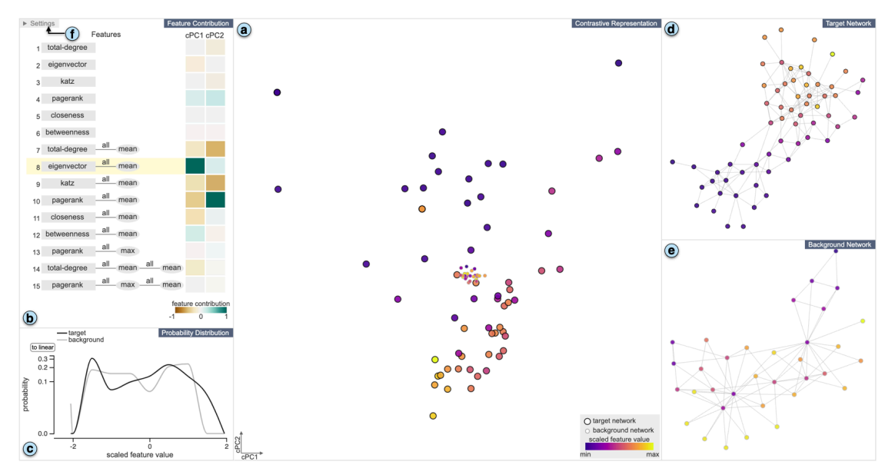

# **2022.01.13**

## Exemplar-based Layout Fine-tuning for Node-link Diagrams

步骤:

* 计算整个图的node embedding来检索相似子结构，给图初始布局
* 用户从全图中指定一个exempler，通过某种算法检索出拓扑结构类似于exempler的子结构。用户也可以直接在图中指定这些子结构子结构
* 用户修改exempler的布局，算法将该修改传播到所有前一步中的target子结构
* 算法将对子结构布局的修改合并到原图中，同构全局优化来平滑边界

### 1. WorkFlow

#### 1.1 node-embedding-based representation

通过node embedding将子图检索问题简化为一个多维数据的搜索问题。使用GraphWave用作node embedding

#### 1.2 Specifying Exempler and Targets

使用套索来指定一个子结构(Fig.3a)，并通过一种structure-query技术来检索和目标样例相似的子结构(参考文献[4])。

#### 1.3 User-driven fine-tuning

dragging interaction来交互式地调整exempler布局，随后修改被转移到所有其他的目标子结构

#### 1.4 Global Layout Optimization

直接将修改后的子图布局嵌入到原图中会产生突兀的boundary，因而需要global optimization。

类似于stress majorization， 最小化每个节点对之间的位置的期望距离和实际距离。但是优化整个图需要较大的计算量，因此只需要优化target substructures周围的局部的图即可。定义为距离某个substructure小于d的所有节点的导出子图

### 2. Modification Transfer

source substructure$S=(V^S, E^S)$, target substructure$T=(V^T, E^T)$ 三个步骤:

* Marker selection: 使用图匹配方法对齐S和T，找到匹配度高的节点
* 改变T->T‘来模拟S，并扩展M
* 改变T’来模拟S‘

### 3. Marker Selection

预先对exempler和target substructure单独进行布局，然后使用Factorized Graph Matching（FGMU）进行图匹配。但是算法会对所有的点都进行匹配，从而产生一些不是那么好的配对点对。因此需要进行filtering. 首先依据配对来对两个layout进行对齐(Section4.2)，然后找到fine correspondences $(c_i^s, c_i^t)$:

* 两者之间的距离小于它们相邻边的平均距离乘以某个ratio
* $c_i^s$的邻居节点尽可能和$c_i^t$的邻居节点配对

### 4. Layout Simulation

#### 4.1 Aligning

对目标子结构进行放缩，旋转，平移来最小化两个布局之间的差异，因为二者期望是类似的子结构，拥有者类似的布局位置。

需要预定义一小部分markers $M=\{(m_i^s, m_i^t)\}$, 通过仿射变换$R$，解下面的最优化问题

$$\min_R \sum^{|M|}\|Rm_i^t-m_i^s\|^2$$

#### 4.2 Deforming

改变T的结构来模拟S，即让所有的$m_i^t$的位置接近于$m_i^s$,定义energy function

$$E = E_S + \gamma E_M$$
其中$E_M$是所有markers对的距离之和
$E_S$衡量了是T变换到T’的layout的变化

$E_S=\alpha E_O + \beta E_D$
其中$E_O$保持所有节点对在变换layout后的大致方向，$E_D$保持变换后所有节点对之间的大致距离

然后使用类似于stress majorization的优化方法来优化$E_O$和$E_D$

#### 4.3 Matching

在进行Deforming之后，再一次进行节点之间的匹配。所有距离在$r_j$之内的来自S和T的节点对作为一个匹配对应的候选，使用匈牙利算法来找到这些配对之间的一个最大数量的配对

Aligning, Deforming, Matching交替进行，来将目标的布局尽量接近于给定的样例的布局变化

## **A Visual Analytics Framework for Contrastive Network Analysis**

1. ### **Contrative network representation learning**

   使用DeepGL做表征学习(NRL)提取特征，使用cPCA做对比学习(CL)

#### **1.1 NRL with DeepGL**

生成的特征由base feature$X$和relational function $f$组成。base feature衡量了能从每个节点得到的特征，如入度、出度或一些更深层的属性等等。relational function是一个关系特征操作子（RFO）的组合，每个特征operator总结了一个节点和它的one-hop节点，也就是它的邻居节点之间的某种运算关系，如mean，sum，maximum。

#### **1.2 CL with cPCA**

cPCA最大化目标$X_t$投影后的方差而最小化background方差X_B，是PCA的扩展. 得到投影后的表征$Y_T,Y_B$.

1. ### **Design Consideration**

-  Disovery

- Interpretability

-  Intuitiveness

-  Flexibility

1. ### **Visualization**

contrastive network比对流程:

- DeepGL生成网络特征

- cPCA生成target和background对比的网络表征

-  确定target network是否有独特性(view a)

- 解释网络特征和对比主成分

- 关联独特性和补充的可视化

界面:

​                         

-  A: target network和background network在cPCA后的特征分布

- B: feature中不同的特征对于主成分方向的贡献程度

- C: target network和background network中的在view B中选择的feature的概率分布，其实也就是特征的频率分布

-  D, E: 具体的target network和background network

在cPCA后投影的低维空间内，target network的独特性将被放大，表现为其特征点的空间位置更加分散(方差更大)，也代表着两个图之间的属性差异。

## **备注**

今天的两篇文章是之前积累但未详细阅读的两篇工作。周计划从1.14开始

## **周计划 2022.01.14~2022.01.20**

## **本周粗计划细读文章六篇如下：**

- 2014_Deepwalk online learning of social representation
- 2016_node2vec scalable feature learning for networks
- 2017_struc2vec learning node representations from structural identity
- 2019_motif2vec_Motif_Aware_Node_Representation_Learning_for_Heterogeneous_Networks
- 2015_Distilling the knowledge in a Neural Network
- 2017_VIGOR_Interactive_Visual_Exploration_of_Graph_Query_Results

部分文章可能能较快阅读完成，或是某些文章的阅读可能涉及到学习额外内容，因此只是大致计划，具体阅读以实际为准。

【Dong】文中提到文献4是指哪篇文章？开了好头，继续加油！可以在阅读时记录下自己认为可以改进的点。

# 2022.01.14

## 2016_node2vec scalable feature learning for networks

学习网络节点的低维空间映射，最大化保持网络节点邻居的likelihood

presented work: 提出node2vec，一个网络特征学习的半监督算法，使用SGD优化，返回在d维空间下的特征表征来最大化保持节点邻居的likelihood，使用2阶随机游走来生成网络节点的邻居

本文贡献

* node2vec算法
* 证明了node2vec是符合建立的网络科学原理的，提供在寻找不同等价物表征时的灵活性
* 基于neiborhood preserving objectives扩展node2vec和其他特征学习算法
* 经验性地在现实数据集上测试了node2vec

### 1. Feature Learning Framework

将skip-gram架构扩展到网络中，致力于优化下面的目标函数
$$
max_f \sum_{u\in V}\log Pr(N_s(u)|f(u))
$$
$N_s$是节点邻居，$f$是节点特征表征

两个假设：

* 条件独立：给定特征表征，观测一个邻居节点和观测其他邻居节点是独立的，即
  $$
  Pr(N_s(u)|f(u))=\Pi_{n_i\in N_s(u)}Pr(n_i|f(u))
  $$

* 源节点和邻居节点在特征空间对彼此有着对称的影响
  $$
  Pr(n_i|f(u))=\frac{\exp(f(n_i)\cdot f(u))}{\sum_{v\in V}\exp (f(v)\cdot f(u))}
  $$
  （由于标准化向量的内积通常对应着在向量空间二者的角度关系，因此最大化上面的似然函数，相当于使得角度空间中两个结点更近，对应在原图上就是邻居节点）

从而目标函数变为
$$
\max_f\sum[-\log Z_u+\sum_{n_i\in N_s(u)}f(n_i)\cdot f(u)]
$$
$Z_u$难于计算，因此采用负采样(negtive sampling)的方法来近似。使用随机梯度下降来优化目标函数

#### 1.1 Classic search strategy

BFS和DFS。

图上节点的两种相似性：homophily和structural equivalence

#### 1.2 Node2vec

可视作介于dfs和bfs的方法

##### 1.2.1 random walks

依照一定的转移概率从起始节点出发生成一条random walk

##### 1.2.2 search bias $\alpha$

定义了参数$p$和参数$q$来控制random walk的过程。假设当前的random walk刚刚经过边$(t, v)$，现在要决定下一步$(v, x)$，设定转移的unnormalized转移概率$\pi_{vx}=\alpha_{pq}(t,x)\cdot w_{vx}$, 其中$\alpha_{pq}(t, x)$为

* $\frac{1}{p}, d_{tx}=0$
* $1, d_{tx}=1$
* $\frac{1}{q}, d_{tx}=2$

$d_{tx}$指两个节点$t, x$的图上距离

random walk的好处：

* 便于计算，空间复杂度低
* 时间复杂度相比较于classic search也很低

##### 1.2.3 算法

random walk存在隐形bias，源自于选择的起始节点$u$。但是任务是学习所有节点的向量表征，因此算法从每个节点起始都会做random walk。